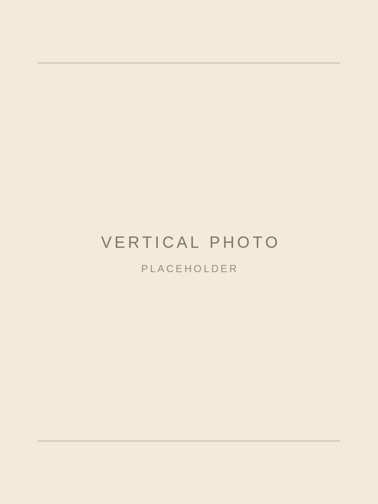

# Matthew Hitchcock Portfolio Site

A static portfolio site designed for GitHub Pages.

## Current structure

1. Landing page with top and bottom ticker bars
2. About me section with a vertical photo placeholder
3. Portfolio section with full-width project buttons
4. Contact me section
5. Footer disclaimer

## Files

- `index.html` - main portfolio page
- `styles.css` - layout, colors, typography, responsive styles, ticker animation, and section styling
- `case-study-template.html` - reusable case study page linked from the portfolio buttons
- `assets/` - placeholder SVGs and favicon/social preview files

## Fonts

The site uses Adobe Fonts through this stylesheet:

```html
<link rel="stylesheet" href="https://use.typekit.net/ipr2mdn.css">
```

Current font direction:

- Hero title: `jack`
- Body/interface copy: `slight-chance`
- Main headings/project titles: `bc-alphapipe`

## Quick edits before publishing

Replace these placeholders:

- `LinkedIn`
- `Instagram`
- `Spotify soon`
- Portfolio project titles, categories, links, and images
- `assets/about-portrait-placeholder.svg` with a real vertical photo

To replace the About photo, update this line in `index.html`:

```html

```

For example:

```html

```

## Contact form

The contact form in `index.html` uses Formspree with this endpoint:

```html
<form class="contact-form" action="https://formspree.io/f/xzdwlbbp" method="POST">
```

The form collects:

- `email`
- `message`

It also sends a hidden subject line: `New portfolio contact form message`. Update that hidden field if you use a different domain or subject.

## Deploy on GitHub Pages

1. Create a new GitHub repository.
2. Upload all files in this folder to the repository root.
3. Go to `Settings` > `Pages`.
4. Under `Build and deployment`, choose `Deploy from a branch`.
5. Select the `main` branch and `/root` folder.
6. Save.

GitHub will publish the site after the first build.
